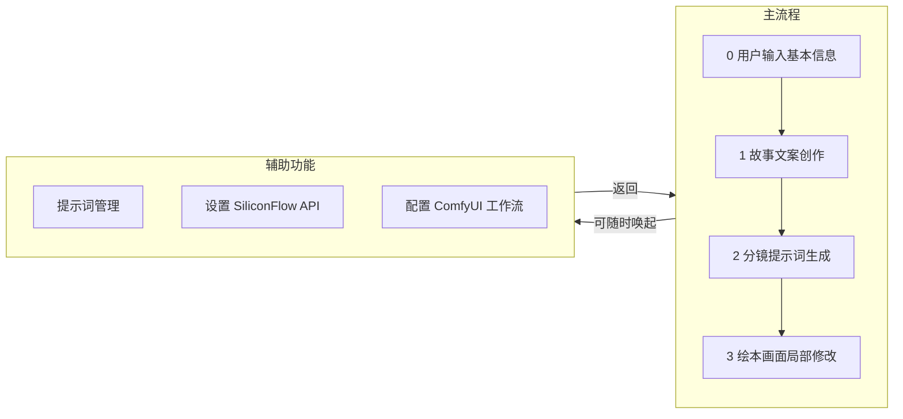

# 一、UI 设计逻辑与页面关系

## 1. 设计逻辑

1. **流程驱动**：采用“左→右”或“顶→底”步骤切换，每一步作为独立页面，保证用户聚焦当前任务。
2. **统一导航**：顶部显示全流程进度，点击可跳转；底部操作按钮「返回」「下一步/完成」贯穿始终。
3. **弹窗/侧栏**：辅助功能（提示词管理、设置、ComfyUI 配置）均以模态弹窗或侧栏形式加载，不干扰主流程。
4. **可视化反馈**：各步骤中，AI 生成结果（脚本、提示词）和图像编辑区均提供示例占位，帮助开发与测试。

## 2. 页面关系思维导图

# 二、拆分后绘本创作工作流模块

以下模块将用于后端接口设计与协同开发（不涉及具体技术栈）：

1. **基础信息采集模块**

   * 接收用户主题、适龄段、故事风格输入
   * 返回确认缓存与校验

2. **故事文案生成模块（AI）**

   * 调用 GPT（SiliconFlow Chat API）
   * 输入：主题、适龄、风格
   * 输出：分段文本脚本

3. **提示词管理模块**

   * 提示词分类与版本管理（文稿提示词 / 分镜提示词）
   * 支持增删改查
   * 与前端弹窗联动读取与存储

4. **分镜提示词生成模块（AI）**

   * 调用 GPT（SiliconFlow Chat API）
   * 输入：脚本各段文本 + 当前提示词库
   * 输出：每个分镜的生成提示词

5. **图像生成队列模块**

   * 批量调用豆包（Doubao）API
   * 管理任务进度、重试机制、结果存储

6. **ComfyUI 后处理模块**

   * 接收前端上传/选中图片
   * 提供节点化工作流配置接口
   * 调用本地/远程 ComfyUI 服务进行图像微调

7. **流程状态管理模块**

   * 记录每个项目的当前步骤与完成状态
   * 支持流程跳转、恢复

8. **导出与资产管理模块**

   * 汇总脚本、提示词、原图与后处理图
   * 打包输出（PDF/EPUB/ZIP/PPTX）

# 三、AI 模块概览

* **SiliconFlow Chat API** （脚本生成、提示词生成）
* **Doubao 批量图像生成 API**
* **ComfyUI** 可视化节点工作流接口

以上逻辑图与模块定义将指导后端接口与服务拆分，确保前后端协同开发有清晰边界与契约。
