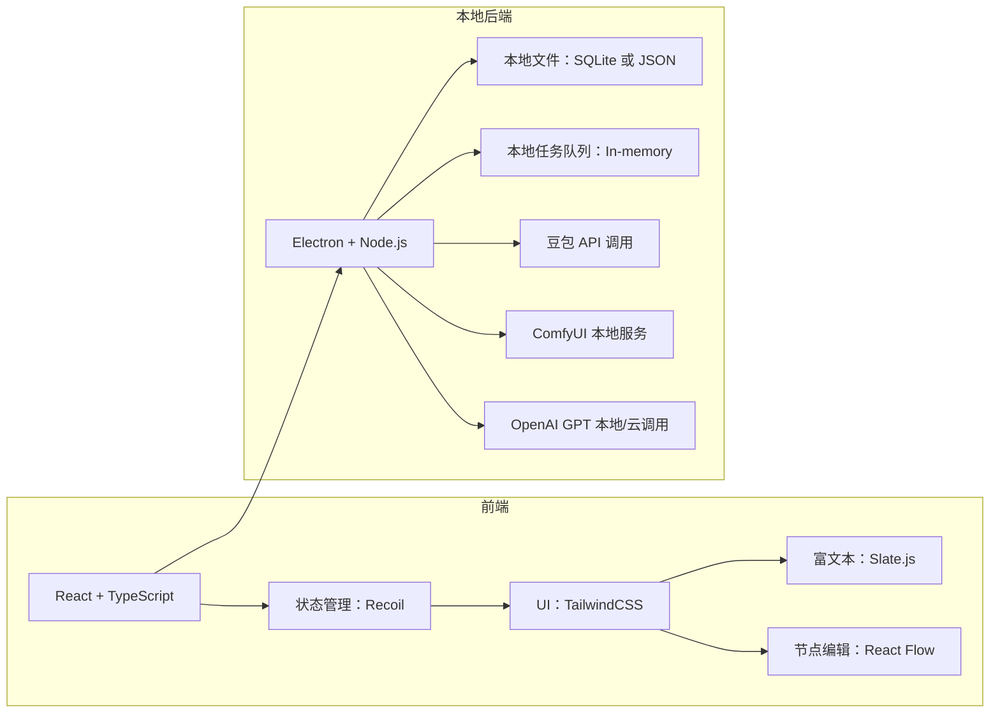

# 项目模块化流程与 UI 设计方案

## 一、整体流程模块拆分

本工具将传统创作流程拆分为以下模块，每个模块通过UI和后台服务解耦，实现高效协同与可扩展性：

1. **风格与模板管理模块**

   * 管理并展示[AI 绘本风格模块](#参考资料)（共10种）fileciteturn0file0
   * 支持风格筛选、主题与年龄匹配、模板预览、用户自定义风格

2. **脚本生成模块**

   * 基于 GPTs 指令与配套知识库，自动生成中英双语旁白和场景大纲
   * 对于经典改编请求，调用经典改编流程，保留原作结构与标题，简化语言表达、强化文化寓意fileciteturn0file2
   * 接口：`/api/script/generate`

3. **提示词管理模块**

   * 从脚本和选定风格模板中自动提取关键词，生成初版 AI 提示词
   * 支持用户按场景调整提示词（如环境、角色细节）
   * 接口：`/api/prompt/prepare`

4. **批量图像生成模块**

   * 集成“豆包”批量调用，异步提交多场景提示词生成原始图片
   * 支持查看任务进度、重试失败任务、下载原图批次
   * 接口：`/api/image/doubao/batch`

5. **图像后处理模块**

   * 使用 ComfyUI 流水线对原图进行重绘与细化（如风格统一、细节增强）
   * 提供可视化节点编辑面板与批处理设置
   * 接口：`/api/image/comfyui/process`

6. **资产管理与导出模块**

   * 管理所有生成的脚本、提示词、原图与后处理图
   * 支持批量打包导出 EPUB、PDF、ZIP、PPTX 等格式
   * 接口：`/api/export`

7. **协作与审核模块**

   * 内置评论、版本回溯与任务看板
   * 权限管理：作者、审核、管理员
   * 接口：`/api/collaboration`

## 二、关键页面 UI 设计（简化版）

针对个人本地使用场景，移除登录/注册和权限管理：

1. **项目仪表盘**

   * 直接进入页面，无需登录；
   * 卡片式展示所有本地项目，包含进度条、场景数量、最后编辑时间

2. **风格与模板中心**

   * 列表/网格视图展示 10 种风格（名称、适龄、主题标签、示例预览），支持筛选

3. **脚本生成与编辑页面**

   * 左侧：风格选择与脚本参数（年龄、主题、关键词、是否经典改编）
   * 右侧：中英双栏文本编辑器、版本历史面板（本地保存）
   * 一键“生成脚本”按钮，实时预览输出

4. **提示词编辑页面**

   * 上方：当前场景脚本与角色/环境锚点信息
   * 下方：自动生成提示词列表，支持多行编辑与增删场景
   * 一键“批量生成图片”

5. **批量生成任务监控**

   * 列表展示本地“豆包”任务状态：待处理、进行中、失败、完成
   * 可查看单任务日志，支持失败重试

6. **ComfyUI 后处理页面**

   * 可视化节点编辑器（拖拽节点、参数面板）
   * 选择需处理的图片批次，一键提交/预览/下载

7. **资产库与导出页面**

   * 筛选脚本、提示词、原图、后图
   * 导出：EPUB、PDF、ZIP、PPTX 等格式（均为本地文件）

8. **本地注释与版本回溯**

   * 针对脚本和提示词提供行内注释
   * 本地文件版本自动备份与恢复

## 三、项目架构与技术方案（简化版）



**技术要点**：

* **本地部署**：基于 Electron 打包，前端与后端同构运行，免配置即可使用
* **数据存储**：轻量 SQLite 或纯 JSON 文件，简易读写
* **异步任务**：本地内存队列管理“豆包”与 ComfyUI 调用，实时更新状态
* **本地版本管理**：利用文件快照记录脚本和提示词历史，支持一键恢复

---

```mermaid
flowchart LR
  subgraph 前端
    A[React + TypeScript] --> B[状态管理：Recoil/Redux]
    B --> C[组件UI：AntD / TailwindCSS]
    C --> D[富文本编辑：Slate.js]
    C --> E[节点编辑：React Flow]
  end
  subgraph 后端
    F[Node.js + NestJS] --> G[REST/GraphQL API]
    G --> H[PostgreSQL]
    G --> I[Redis (任务队列)]
    G --> J[文件存储：AWS S3]
    G --> K[豆包 API 调用]
    G --> L[ComfyUI 服务]
    G --> M[OpenAI GPT 服务]
  end
  subgraph DevOps
    N[Docker & Kubernetes]
    O[CI/CD: GitHub Actions]
    P[监控: Prometheus + Grafana]
  end
  A --> F
```

**技术要点**：

* 异步任务管理：使用 Bull 或自研队列，结合 Redis 存储任务状态
* 脚本/提示词协同：采用 OT 算法或 Yjs 实现多人实时编辑
* ComfyUI 可视化：集成 React Flow 构建节点式 UI
* 安全与权限：OAuth2.0 + JWT；细粒度权限控制

---

### 参考资料

1. **AI 绘本风格模块 JSON**（10 种风格定义）fileciteturn0file0
2. **GPT 绘本创作指令手册**（脚本生成流程）fileciteturn0file1
3. **经典改编 GPT 指南**（改编原则与流程）fileciteturn0file2
